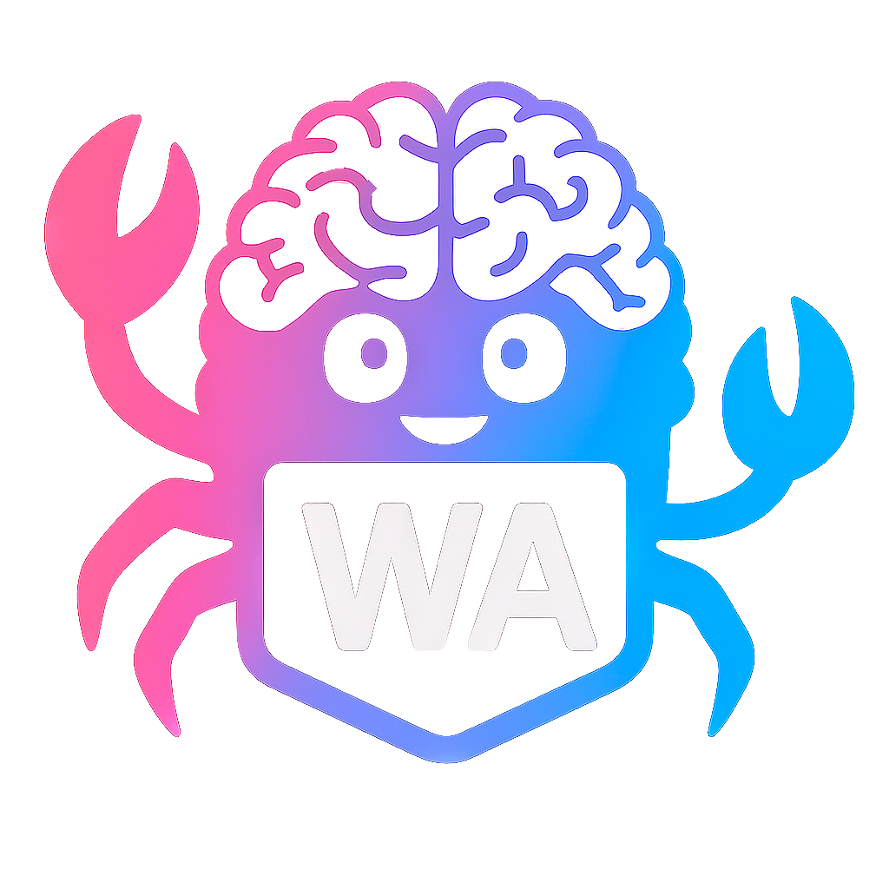

<div align="center">
  
</div>

# 🚀 Wasm Knowledge Chatbot - Local GraphRAG Chat Interface

[](https://www.rust-lang.org/)
[](https://webassembly.org/)
[](https://leptos.dev/)
[](https://tailwindcss.com/)
[](https://daisyui.com/)

[](https://opensource.org/licenses/MIT)
[](https://webllm.mlc.ai/)

> 🤖 A blazingly fast, modern chat interfac, built entirely in Rust with WebAssembly and featuring local AI model execution via WebLLM.

## ✨ Features

- 🎨 **Modern UI**: Perplexity-inspired design with clean, professional aesthetics
- 🌓 **Dark/Light Theme**: Toggle between themes with DaisyUI's theme system  
- 📱 **Responsive Design**: Collapsible sidebar that adapts to screen size
- 🤖 **WebLLM Integration**: Local AI model execution directly in the browser
- 💬 **Real-time Chat**: Interactive chat interface with message bubbles and timestamps
- 🔍 **Knowledge Toggle**: Enable/disable knowledge graph integration
- 📊 **Status Bar**: Real-time status updates and model loading progress
- ⚡ **Blazing Fast**: Built with Rust/WASM for near-native performance
- 🔒 **Privacy-First**: All AI processing happens locally in your browser
- 🎯 **Zero Backend**: Fully client-side application with no server dependencies
 - 🧠 **GraphRAG Settings UI**: Configure GraphRAG search strategies, performance modes, and metrics (`src/components/graphrag_settings*.rs`)
 - 📚 **Knowledge Document Manager**: Upload/search/manage documents with localStorage persistence (`src/components/document_manager_simple.rs`)
 - 🛡️ **Robust Error Handling**: Error boundary, recovery strategies, and offline detection (`src/error_handling.rs`, `src/utils/error_handling.rs`)
 - 🚀 **Performance UX**: Optimized status/progress UI, smooth interactions, and build-time optimizations

## 🏗️ Architecture


## 🛠️ Tech Stack

| Category           | Technology                                               | Version      | Purpose                        |
| ------------------ | -------------------------------------------------------- | ------------ | ------------------------------ |
| **Core Framework** | [Leptos](https://leptos.dev/)                            | 0.8          | Reactive web framework in Rust |
| **Language**       | [Rust](https://www.rust-lang.org/)                       | 2021 Edition | Systems programming language   |
| **Runtime**        | [WebAssembly](https://webassembly.org/)                  | Latest       | High-performance web runtime   |
| **AI Engine**      | [WebLLM](https://webllm.mlc.ai/)                         | Latest       | Local LLM execution in browser |
| **Styling**        | [Tailwind CSS](https://tailwindcss.com/)                 | ^3.4.0       | Utility-first CSS framework    |
| **UI Components**  | [DaisyUI](https://daisyui.com/)                          | ^4.12.10     | Semantic component library     |
| **Icons**          | [Lucide](https://lucide.dev/)                            | Latest       | Beautiful & consistent icons   |
| **Build Tool**     | [Trunk](https://trunkrs.dev/)                            | Latest       | WASM web application bundler   |
| **Bundling**       | [wasm-bindgen](https://rustwasm.github.io/wasm-bindgen/) | 0.2          | Rust-WASM-JS interop           |

## 📁 Project Structure

```
wasm-knowledge-chatbot-rs/
├── src/
│   ├── components/
│   │   ├── main_interface.rs
│   │   ├── chat_area.rs
│   │   ├── input_area.rs
│   │   ├── message_bubble.rs
│   │   ├── status_bar.rs
│   │   ├── llm_select.rs
│   │   ├── conversation_history.rs
│   │   ├── conversation_list.rs
│   │   ├── sidebar.rs
│   │   ├── sidebar_action.rs
│   │   ├── sidebar_monitor.rs
│   │   ├── graphrag_settings.rs
│   │   ├── graphrag_settings_modal.rs
│   │   ├── document_manager_simple.rs
│   │   ├── ui_primitives.rs
│   │   └── mod.rs
│   ├── models/                   # Data structures & types (directory)
│   ├── utils/
│   │   ├── icons.rs
│   │   ├── storage.rs
│   │   ├── error_handling.rs
│   │   └── mod.rs
│   ├── error_handling.rs         # Error boundary & recovery
│   ├── webllm_binding.rs         # WebLLM JS bindings
│   ├── lib.rs                    # Main app component
│   └── main.rs                   # Entry point
├── tests/                        # Comprehensive Rust test suite (*.rs)
│   ├── graphrag_engine_tests.rs
│   ├── knowledge_storage_tests.rs
│   ├── ... (more)
│   ├── test_components.html
│   └── debug-theme.html
├── public/ (input.css, output.css, favicon.ico)
├── Trunk.toml
├── tailwind.config.js
├── index.html
├── Cargo.toml
├── package.json
└── README.md
```

## 🧩 Key Components

### 🏠 MainInterface
The root orchestrator managing layout, global state, and integrations:
- **State Management**: Sidebar, model selection, knowledge toggle, error state
- **Layout Coordination**: Responsive design with accessibility and mobile considerations
- **Integrations**: GraphRAG settings, document manager, status bar, error boundaries

### 📋 Sidebar  
Adaptive navigation panel with intelligent responsive behavior:
- **Responsive Design**: 80px (collapsed) ↔ 320px (expanded)
- **Model Selection**: Interactive dropdown for AI model switching
- **Action Buttons**: File upload, knowledge graph, new chat functionality
- **History Management**: Recent conversation access and management

### 💬 ChatArea
Core conversation interface with real-time message handling:
- **Message Rendering**: User/assistant message differentiation with styling
- **Real-time Updates**: Live message streaming and display
- **Progress Indicators**: Model loading and response generation feedback
- **Scroll Management**: Auto-scroll and message history navigation

### ⌨️ InputArea
Intelligent message input system with enhanced UX:
- **Keyboard Support**: Enter key submission with Shift+Enter for new lines
- **Knowledge Toggle**: Contextual knowledge graph integration control
- **Input Validation**: Message length and content validation
- **Loading States**: Visual feedback during message processing

### 🤖 WebLLM Integration
Advanced local AI model execution system:
- **Model Loading**: Progressive loading with real-time progress callbacks
- **Message Processing**: Efficient conversation context management
- **Error Handling**: Robust error recovery and user feedback
- **Performance Optimization**: Memory-efficient model switching

## 🎨 DaisyUI Components & Theming

### Component Library
| Component  | Usage               | Variants                                   |
| ---------- | ------------------- | ------------------------------------------ |
| `btn`      | Interactive buttons | `ghost`, `outline`, `primary`, `secondary` |
| `input`    | Text inputs         | `bordered`, `ghost`, with focus states     |
| `chat`     | Message bubbles     | `chat-start`, `chat-end` with alignment    |
| `dropdown` | Model selection     | `dropdown-content`, `dropdown-toggle`      |
| `toggle`   | Knowledge switch    | `toggle-primary`, `toggle-secondary`       |
| `join`     | Input groups        | `join-item` for seamless connections       |
| `badge`    | Status indicators   | `badge-primary`, `badge-ghost`             |

### Custom Theme System
Note: The current `tailwind.config.js` uses DaisyUI themes `"light"` and `"business"` (darkTheme = `"business"`). The following is an example of how to define a custom theme:
```javascript
// tailwind.config.js
daisyui: {
  themes: [
    "light",
    {
      black: {
        "color-scheme": "dark",
        primary: "oklch(40% 0.15 270)",      // Purple accent
        "base-100": "oklch(0% 0 0)",         // Pure black background
        "base-content": "oklch(95% 0 0)",    // Near-white text
        // ... optimized for readability and modern aesthetics
      }
    }
  ]
}
```

## 🎨 Lucide Icons Integration

Dynamic icon rendering system with automatic re-initialization:

```rust
// src/utils/icons.rs - Current implementation
use wasm_bindgen::prelude::*;

#[wasm_bindgen]
extern "C" {
    #[wasm_bindgen(js_namespace = lucide)]
    fn createIcons();

    #[wasm_bindgen(js_namespace = console)]
    fn log(s: &str);
}

pub fn render_lucide_icons() {
    if let Some(window) = web_sys::window() {
        match js_sys::Reflect::get(&window, &"lucide".into()) {
            Ok(lucide) => match js_sys::Reflect::get(&lucide, &"createIcons".into()) {
                Ok(create_icons_fn) => {
                    let _ = js_sys::Function::from(create_icons_fn).call0(&lucide);
                }
                Err(_) => log("Lucide createIcons function not found"),
            },
            Err(_) => log("Lucide library not loaded"),
        }
    }
}

pub fn schedule_icon_render() {
    wasm_bindgen_futures::spawn_local(async {
        gloo_timers::future::TimeoutFuture::new(100).await;
        render_lucide_icons();
    });
}
```

### Icon Usage Examples
- 🤖 `bot` - AI assistant messages
- 👤 `user` - User messages  
- ⚙️ `settings` - Configuration panels
- 🌓 `sun`/`moon` - Theme toggle
- 📤 `send` - Message submission
- 📁 `folder` - File operations

## 🚀 Quick Start

### Prerequisites
```bash
# Install Rust (if not already installed)
curl --proto '=https' --tlsv1.2 -sSf https://sh.rustup.rs | sh

# Install required tools
cargo install trunk
rustup target add wasm32-unknown-unknown

# Install Node.js dependencies (for Tailwind CSS)
npm install
```

### Development Setup
```bash
# Clone the repository
git clone https://github.com/your-username/wasm-llm.git
cd wasm-llm

# Install dependencies
npm install

# Start development server with hot reload
npm run dev
# or manually:
# npm run build-css && trunk serve --open
```

### Build Commands
```bash
# Development build
npm run build

# Production build (optimized)
trunk build --release

# Watch CSS changes
npm run watch-css

# Build CSS only
npm run build-css
```

### 🐳 Docker Support (Optional)
```dockerfile
FROM rust:1.75 as builder
RUN cargo install trunk
RUN rustup target add wasm32-unknown-unknown
COPY . .
RUN trunk build --release

FROM nginx:alpine
COPY --from=builder /dist /usr/share/nginx/html
```

## 🎨 Customization Guide

### 🌈 Theme Customization
Create custom themes by extending the DaisyUI configuration:

```javascript
// tailwind.config.js
daisyui: {
    themes: [
        "light",
        {
            "cyberpunk": {
                "color-scheme": "dark",
                "primary": "#ff00ff",
                "secondary": "#00ffff", 
                "accent": "#ffff00",
                "base-100": "#0a0a0a",
                "base-content": "#ffffff",
                // ... complete theme definition
            }
        }
    ]
}
```

### 🤖 Adding WebLLM Models
Extend the model selection by updating the LLM configuration:

```rust
// In sidebar.rs or a dedicated config file
let llms = vec![
    LLMModel {
        id: "Llama-3.2-3B-Instruct-q4f32_1-MLC".to_string(),
        name: "Llama 3.2 3B".to_string(),
        provider: "Meta".to_string(),
        logo_slug: "meta".to_string(),
    },
    LLMModel {
        id: "Phi-3.5-mini-instruct-q4f16_1-MLC".to_string(),
        name: "Phi 3.5 Mini".to_string(),
        provider: "Microsoft".to_string(),
        logo_slug: "microsoft".to_string(),
    },
    // Add your custom models here
];
```

### 🎯 Component Styling
Customize components using Tailwind utilities and DaisyUI classes:

```rust
// Example: Custom message bubble styling
view! {
    <div class="chat chat-start">
        <div class="chat-bubble bg-gradient-to-r from-purple-500 to-pink-500 text-white">
            {message.content}
        </div>
    </div>
}
```

### 📱 Responsive Breakpoints
Customize responsive behavior in `tailwind.config.js`:

```javascript
theme: {
    extend: {
        screens: {
            'xs': '475px',
            '3xl': '1600px',
        }
    }
}
```

## ⚡ Performance Metrics

Note: The following values are indicative and vary by device, browser, and selected model.

| Metric                  | Value            | Notes                                   |
| ----------------------- | ---------------- | --------------------------------------- |
| **Bundle Size**         | ~200KB gzipped   | WASM + JS optimized build               |
| **First Load**          | ~100ms           | On modern browsers with fast connection |
| **Runtime Performance** | Near-native      | WebAssembly execution speed             |
| **Memory Usage**        | ~2MB baseline    | Excluding loaded AI models              |
| **Model Loading**       | 50-500MB         | Depends on selected model size          |
| **Inference Speed**     | 10-50 tokens/sec | Varies by device and model              |

### 🔧 Optimization Features
- **Tree Shaking**: Dead code elimination in release builds
- **LTO (Link Time Optimization)**: Enabled for maximum performance
- **Code Splitting**: Lazy loading of non-critical components
- **WASM Optimization**: `opt-level = 'z'` for size optimization
- **Progressive Loading**: Models loaded on-demand with progress feedback

## 🌐 Browser Compatibility

| Browser           | Minimum Version | WebLLM Support | Notes                                  |
| ----------------- | --------------- | -------------- | -------------------------------------- |
| **Chrome**        | 88+             | ✅ Full         | Recommended for best performance       |
| **Edge**          | 88+             | ✅ Full         | Chromium-based, excellent support      |
| **Firefox**       | 89+             | ✅ Full         | Good performance, some GPU limitations |
| **Safari**        | 14+             | ⚠️ Limited      | WebGPU support varies by version       |
| **Mobile Chrome** | 88+             | ✅ Full         | Works on Android devices               |
| **Mobile Safari** | 14+             | ⚠️ Limited      | iOS WebGPU support improving           |

### Requirements
- **WebAssembly**: Required for core functionality
- **WebGPU**: Recommended for AI model acceleration
- **SharedArrayBuffer**: Required for WebLLM threading
- **JavaScript Modules**: ES6+ module support


### Feature Detection
Conceptual example of capability detection and graceful degradation:
```rust
// Automatic capability detection
if webgpu_available {
    // Use GPU acceleration
} else if webgl_available {
    // Fallback to WebGL
} else {
    // CPU-only mode with performance warning
}
```

## 🧪 Testing & CI

### Local tests
- **Unit/Integration**: Run `cargo test` for non-WASM logic.
- **WASM browser tests**: A convenience script runs headless Firefox + wasm-bindgen tests.

```bash
# Headless Firefox tests (see scripts/run-wasm-tests.sh)
chmod +x scripts/run-wasm-tests.sh
scripts/run-wasm-tests.sh
```

Notes:
- Requires Firefox and Geckodriver. In CI this is provisioned automatically.
- Ensure `wasm32-unknown-unknown` target is installed: `rustup target add wasm32-unknown-unknown`.

### Continuous Integration
The current workflow in `.github/workflows/ci.yml`:
- **Rust job**: `cargo check`
- **Build & Pages deploy**: Tailwind build, Trunk release build, copies `dist/` to `docs/`, uploads and deploys via GitHub Pages

Notes:
- Toolchains installed per job (nightly for check, stable for build) with the `wasm32-unknown-unknown` target.
- Node 18 used for CSS pipeline (`npm ci`, `npm run build-css`).

If you want CI to also enforce `rustfmt`, `clippy`, and run headless WASM tests, extend the workflow accordingly. Local commands are documented below.

### Troubleshooting CI
- __Rustfmt missing on nightly__: Ensure the CI step installs nightly with components `rustfmt, clippy` and `override: true` so it doesn’t skip due to `rust-toolchain.toml`.
- __Geckodriver action resolution__: Use maintained tags (e.g. `browser-actions/setup-geckodriver@latest`). If the marketplace action is unavailable, provision geckodriver via apt as a fallback.
- __Long downloads on cold cache__: Cargo registry is cached via `actions/cache`. Verify the cache key includes `Cargo.lock`.

## 🤝 Contributing

We welcome contributions! Here's how to get started:

### Development Workflow
1. **Fork** the repository
2. **Clone** your fork: `git clone https://github.com/your-username/wasm-llm.git`
3. **Create** a feature branch: `git checkout -b feature/amazing-feature`
4. **Make** your changes with proper testing
5. **Commit** with conventional commits: `git commit -m "feat: add amazing feature"`
6. **Push** to your branch: `git push origin feature/amazing-feature`
7. **Submit** a pull request

### 📋 Contribution Guidelines
- Follow Rust best practices and idioms
- Add tests for new functionality
- Update documentation for API changes
- Use conventional commit messages
- Ensure all CI checks pass

### 🐛 Bug Reports
Use the issue template and include:
- Browser and version
- Steps to reproduce
- Expected vs actual behavior
- Console errors (if any)

### 💡 Feature Requests
- Check existing issues first
- Provide clear use case and rationale
- Consider implementation complexity
- Discuss breaking changes

## 📄 License

This project is licensed under the **MIT License** - see the [LICENSE](LICENSE) file for details.

```
MIT License

Copyright (c) 2024 Wasm Knowledge Chatbot Contributors

Permission is hereby granted, free of charge, to any person obtaining a copy
of this software and associated documentation files (the "Software"), to deal
in the Software without restriction, including without limitation the rights
to use, copy, modify, merge, publish, distribute, sublicense, and/or sell
copies of the Software...
```

## 🙏 Acknowledgments

### Core Technologies
- **[Leptos](https://leptos.dev/)** - Reactive web framework that makes Rust web development a joy
- **[WebLLM](https://webllm.mlc.ai/)** - Bringing large language models to web browsers
- **[DaisyUI](https://daisyui.com/)** - Beautiful, semantic component library for Tailwind CSS
- **[Lucide](https://lucide.dev/)** - Beautifully crafted open source icons
- **[Trunk](https://trunkrs.dev/)** - Build tool for Rust-generated WebAssembly

### Inspiration
- **[Perplexity AI](https://perplexity.ai/)** - UI/UX design inspiration and user experience patterns
- **[ChatGPT](https://chat.openai.com/)** - Conversational interface design patterns
- **[Claude](https://claude.ai/)** - Clean, minimalist chat interface inspiration

### Community
- **Rust Community** - For the amazing ecosystem and helpful community
- **Leptos Discord** - For technical support and framework discussions
- **WebAssembly Community** - For pushing the boundaries of web performance

---

<div align="center">

**⭐ Star this repo if you find it helpful!**

Made with ❤️ and 🦀 by the Wasm Knowledge Chatbot team

[Report Bug](https://github.com/your-username/wasm-llm/issues) • [Request Feature](https://github.com/your-username/wasm-llm/issues) • [Documentation](https://github.com/your-username/wasm-llm/wiki)

</div>